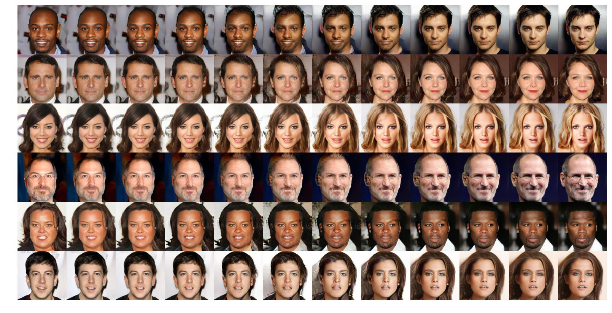
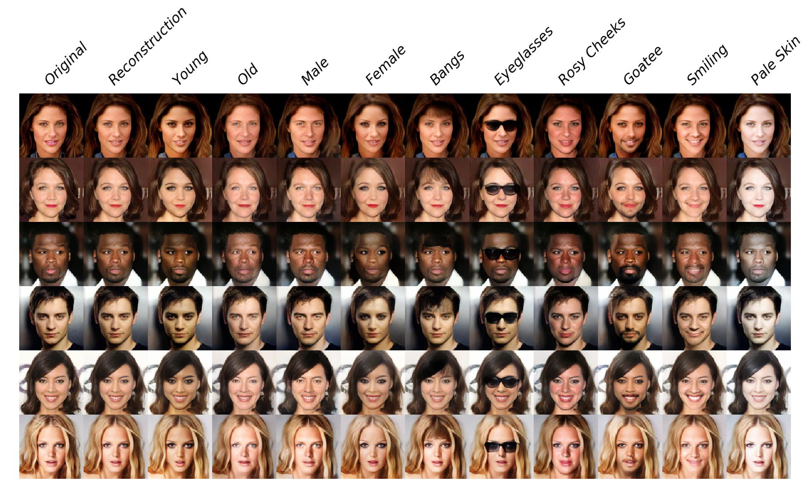

### Generative Adversarial Interpolative Autoencoding (GAIA)

#### Authors: Tim Sainburg, Marvin Thielk, Tim Gentner (UCSD)

The **Generative Adversarial Interpolative Autoencoder (GAIA; [Paper](#); [Blog post](http://timsainburg.com/gaia.html#gaia))** is novel hybrid between the Generative Adversarial Network (GAN) and the Autoencoder (AE). The purpose of GAIA is to address three issues which exist in GANs and AEs:
1. GANs are not bidirectional
2. Autoencoders produce blurry images
3. Autoencoder latent spaces are not convex



#### Instructions
1. Download the GAIA dataset with the notebook '*Create_CELEBA-HQ.ipynb*'
1. Download the trained weights '*download_weights.ipynb*'
2. Run the notebook '*GAIA simple example.ipynb*'

**Note**: I'm currently in the process of rewriting this code to be cleaner, include more features, etc. For now, this is just the version of the code used in the Arxiv paper.



References
- Multimodal Unsupervised Image-to-Image Translation ([Paper](https://arxiv.org/abs/1804.04732); [Author implementation](https://github.com/NVlabs/MUNIT); [Tensorflow implementation](https://github.com/taki0112/MUNIT-Tensorflow))
- [BEGAN](https://arxiv.org/abs/1703.10717)
- [VAEGAN](https://arxiv.org/abs/1512.09300)

```python

```
